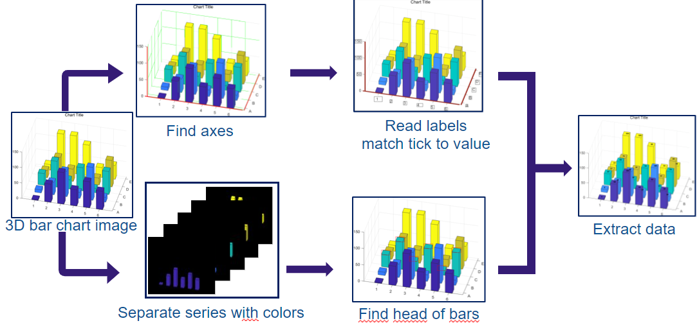
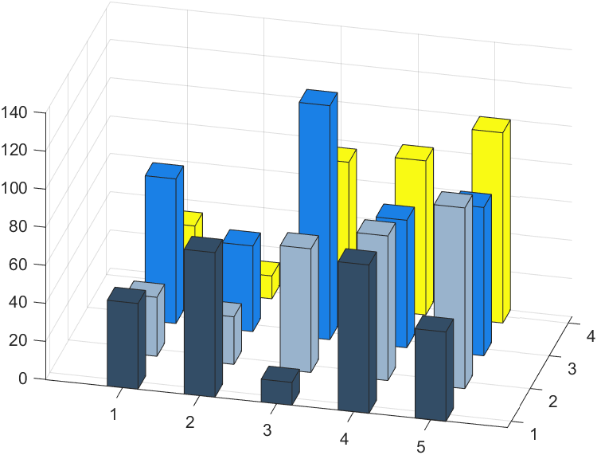
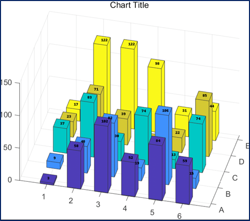

# Automated data extraction from​ 3D bar chart images​


## Overview of the Algorithm



## Environment

python 3.8.5 with virtualenv


## Project Setup

```bash
virtualenv .venv
source .venv/bin/activate
pip install -r requirements.txt
```

## Sample Result
### input data


### predicted data



#### Mean error rate
```
----------Ground truth data----------
    1   2    3    4
1  45  31   76   34
2  76  25   45   12
3  12  65  123   76
4  78  76   67   81
5  47  95   78  100
-------------------------------------

-----------Predicted data------------
              1          2           3          4
miss  45.538288  31.725495   76.234499  33.868761
1     76.658702  25.624439   45.210266  11.968838
2     12.462665  65.833274  123.315278  75.910784
3     78.390684  76.754883   67.097269  80.997630
5     47.366452  95.698306   78.412935  99.941052
-------------------------------------

mean_error_rate :  0.879 %
```